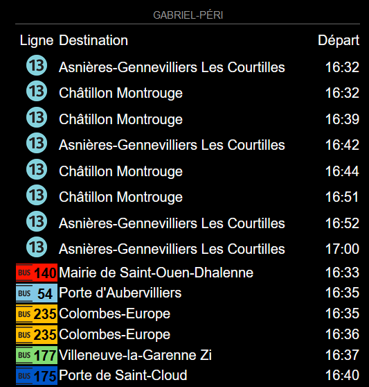
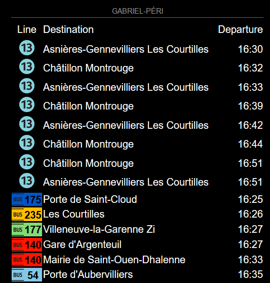
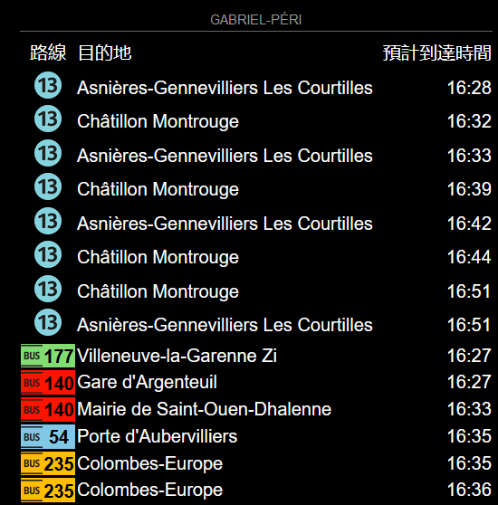

Don't forget to take a look at [MMM-HK-Transport-ETA Module](https://github.com/winstonma/MMM-HK-Transport-ETA) by [winstonma](https://github.com/winstonma) whose older module makes the foundation for this one. 

Dataset about the line (referentiel-des-lignes-de-transport-en-commun-dile-de-france.csv) from [Île de France Mobilités](https://data.iledefrance-mobilites.fr/explore/dataset/referentiel-des-lignes/)
# MMM-IdF-Transport
<B>Station monitor</B> for the <B>Île de France Transport Network</B>.<P>

This module is an extension of the amazing [MagicMirror<sup>2</sup>](https://github.com/MichMich/MagicMirror) project by [MichMich](https://github.com/MichMich/) which has inspired me to share my coding skills with others as well. Check it out, you know you want to :). <P>

It's always nice to see mirrors using my work, so feel free to send me some screenshots of your implementations.<P>

Lastly, why not join in on our discussions at the official [MagicMirror<sup>2</sup> Forum](http://forum.magicmirror.builders/)?

## Screenshots
`fr`             |  `en`
:-------------------------:|:-------------------------:
  |   |
`zh-tw` or `zh-hk`             |  
:-------------------------:|:-------------------------:
  |   |

## Current version

v1.3.0

## Languages
As of version 1.3.0, MMM-HK-Transport features language support for `Chinese (zh-hk and zh-tw)` and `English (en)` mirrors.
This modification feature support for `french (fr)` mirrors.

## Prerequisite
A working installation of [MagicMirror<sup>2</sup>](https://github.com/MichMich/MagicMirror)
 
## Dependencies
  * npm
  * [got](https://github.com/sindresorhus/got)
  * [csv-parse](https://github.com/mafintosh/csv-parser)

## Installation
Go to MagicMirror folder and execute the following command:
```
cd modules
git clone https://github.com/FalseIlyu/MMM-IdF-Transport.git
cd MMM-IdF-Transport
npm install
```

## Module behavior
Please note that this module auto-creates a module header which displays the name of the chosen Hong Kong local transport stop. It is therefore recommended not to add a 'header' entry to your config.js for this module.<P>
This module automatically disappears from your mirror as soon as a station has stopped offering connections at night. It reappears as soon as your chosen station is scheduled to be served again.<P>
This module has been programmed to allow for multiple instances. Simply add more MMM-IdF-Transport config entries to your config.js file to display multiple stations and configure them according to your needs.

## Configuration
Sample minimum configuration entry for your `~/MagicMirror/config/config.js`:

    ...

    {
        module: 'MMM-IdF-Transport',
        position: 'top_left',
        config: {
            apiKey: 'someapikey', // You need to make a key on https://prim.iledefrance-mobilites.fr/fr
            stops: [
                { stopID: 'STIF:StopPoint:Q:473921:' }
            ],
        }
    } 				// If this isn't your last module, add a comma after the bracket

    ...

Sample configuration entry for your `~/MagicMirror/config/config.js` with optional parameters:

    ...
    
    {
			module: 'MMM-IdF-Transport',
			position: 'top_left',
			config: {
				apiKey: 'someapikey', // You need to make a key on https://prim.iledefrance-mobilites.fr/fr
				stops: [
					{
						stopID: 'STIF:StopArea:SP:72203:',
						lineID: 'STIF:Line::C01383:',
					},
				],
				showLabelRow: true, 	// Show or hide column headers
				reloadInterval: 60000, 	// How often should the information be updated? (In milliseconds)
				nbStopInfo: 3		// Maximum nb of stopInfo to show per stop

			}
    } 						// If this isn't your last module, add a comma after the bracket
    
    ...

## Figuring out the correct stopID
1. Open your web browser and navigate to the [Île de France Mobilités Page](https://prim.iledefrance-mobilites.fr).
2. Create an account and generate an API Key.
2. Look for your station in the station reference dataset.
3. Once you can see the stop in your dataset, copy its STIF reference it should look like `STIF:StopPoint:Q:474017:`.

## Config Options
| **Option** | **Default** | **Description** |
| :---: | :---: | --- |
| ApiKey | None, must be generated on [PRIM](https://prim.iledefrance-mobilites.fr) | The key to access the real time arrival/departure API |
| stopID | STIF:StopPoint:Q:473921: | <BR>Which stop would you like to have displayed? <BR><EM> Default: STIF:StopPoint:Q:473921:</EM><P> |
| lineID<BR>`optional` | n\a | <BR>Filter the stop with the specified line<BR><EM>Possible values: STIF:Line::C01383:</EM><P> |
| showLabelRow<BR>`optional` | true | <BR> Show or hide column headers<BR> <EM>Possible values: true, false</EM><P> |
| reloadInterval<BR>`optional`  | 60000 | <BR> How often should the information be updated? (In milliseconds) <BR><EM> Default: Every minute </EM><P> |
| nbStopInfo<BR>`optional`  | n\a | <BR>  Maximum nb of stopInfo to show per stop <BR><EM> Default: All stopInfo will be shown if not set </EM><P> |

